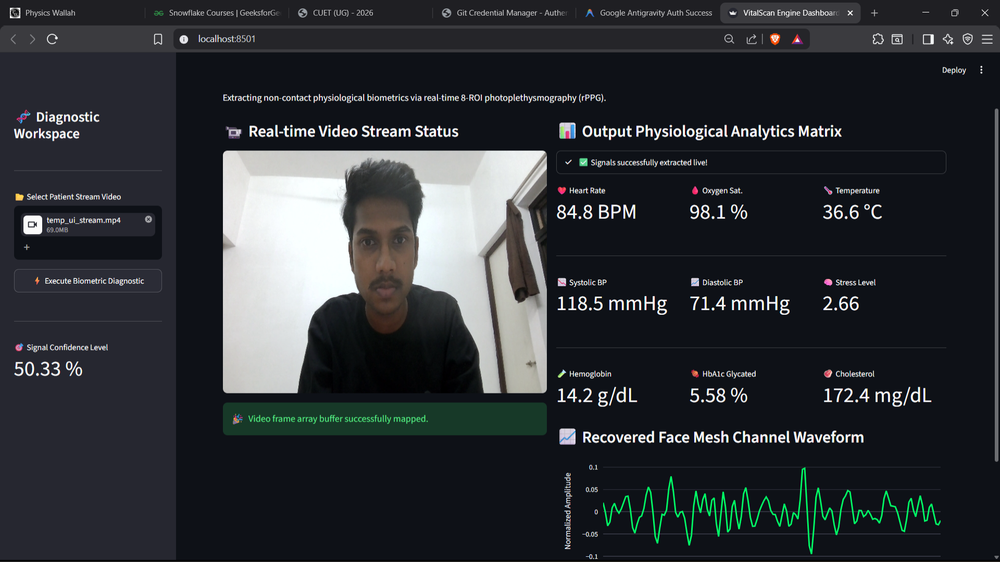

# 🩺 VitoVision
### AI-Powered Contactless Physiological Biomarker Analysis using Remote Photoplethysmography (rPPG)

VitoVision is an AI-powered diagnostic platform that estimates multiple physiological biomarkers from a facial video without requiring any wearable sensors or physical contact.

Using Remote Photoplethysmography (rPPG), facial landmark tracking, and deep learning, the system extracts subtle blood volume pulse signals from facial regions and predicts vital physiological parameters in real time.

---

## ✨ Features

- 🎥 Video-based non-contact physiological analysis
- 🧠 Deep Learning powered rPPG signal processing
- 😊 MediaPipe Face Mesh based facial landmark tracking
- 📍 Multi-ROI facial signal extraction
- 📈 Real-time physiological waveform visualization
- ⚡ Signal confidence estimation
- 📊 Interactive diagnostic dashboard

---

## Physiological Parameters Estimated

VitoVision estimates:

- ❤️ Heart Rate
- 🫁 Respiratory Rate
- 🩸 Systolic Blood Pressure
- 🩸 Diastolic Blood Pressure
- 🫀 Oxygen Saturation (SpO₂)
- 🌡️ Body Temperature
- 🍬 Blood Glucose
- 🧪 Glycated Hemoglobin (HbA1c)
- 🩺 Hemoglobin
- 🫀 Cholesterol
- 📉 Arterial Stiffness
- 🧠 Stress Level

---

# How It Works

The processing pipeline follows these stages:

1. Input facial video
2. Face detection using MediaPipe
3. Multi-ROI facial landmark extraction
4. Remote Photoplethysmography (rPPG) signal recovery
5. Signal preprocessing
6. Deep Learning inference
7. Physiological biomarker prediction
8. Interactive dashboard visualization

---

# Dashboard



The dashboard displays:

- Live video stream
- Signal confidence
- Extracted physiological metrics
- Recovered facial rPPG waveform
- Diagnostic analytics panel

---

# Project Structure

```
HACKATHON11/
│
├── vitalscan-clinic/
│   ├── app.py
│   ├── dataset.py
│   ├── download_data.py
│   ├── notebooks/
│   └── mcd_rppg_600_patients/
│
├── face_landmarker.task
├── production_scnn_approach3.pth
└── ...
```

---

# Dataset

This repository contains a **small demonstration subset** of the MCD-rPPG dataset (approximately 60 samples) to allow the application to run.

The complete dataset is available from:

https://huggingface.co/datasets/wengziheng/mcd_rppg

---

# Technologies Used

- Python
- Streamlit
- PyTorch
- OpenCV
- MediaPipe
- NumPy
- Pandas
- Plotly
- SciPy

---

# Running the Project

Clone the repository

```bash
git clone https://github.com/Akchhansh/vitovision.git
```

Move into the project

```bash
cd HACKATHON11
```

Install the required dependencies.

> A `requirements.txt` file is not currently included. Install the required Python packages manually or generate one using your environment.

Run the application

```bash
streamlit run vitalscan-clinic/app.py
```

---

# Notes

- This project is intended for research, educational, and demonstration purposes.
- The predicted physiological parameters should **not** be considered medical diagnoses.
- The included dataset is a reduced sample intended only for demonstration.

---

# Future Improvements

- Webcam live inference
- Improved deep learning models
- Higher prediction accuracy
- Clinical validation
- Cloud deployment
- Mobile application support

---

# Author

**Akchhansh**

Developed as an AI-powered contactless physiological monitoring system using Remote Photoplethysmography (rPPG).

---

## ⭐ If you found this project interesting, consider giving it a star.
